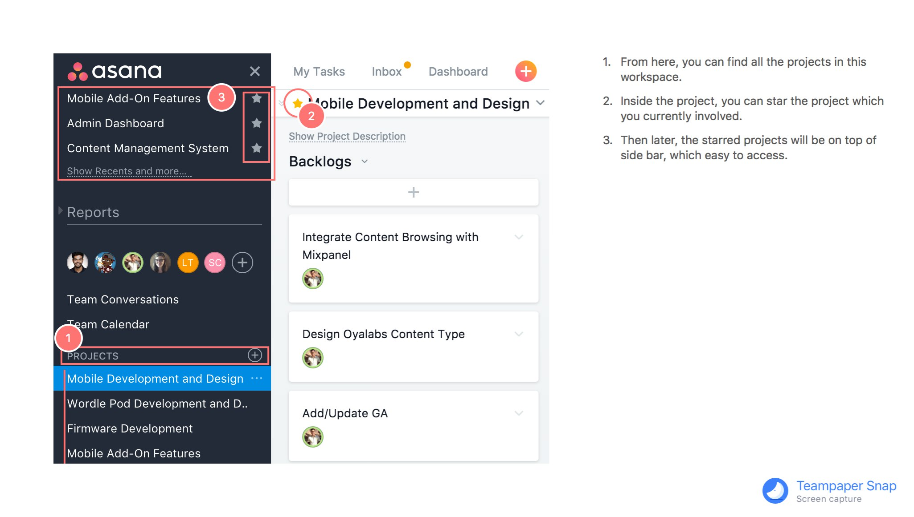
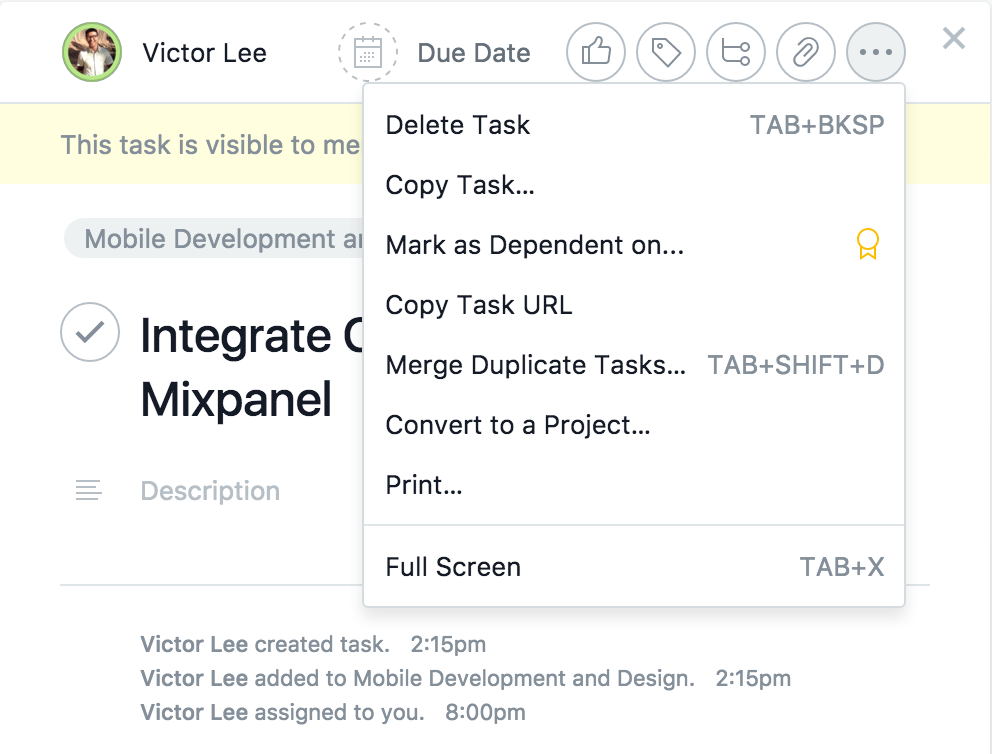
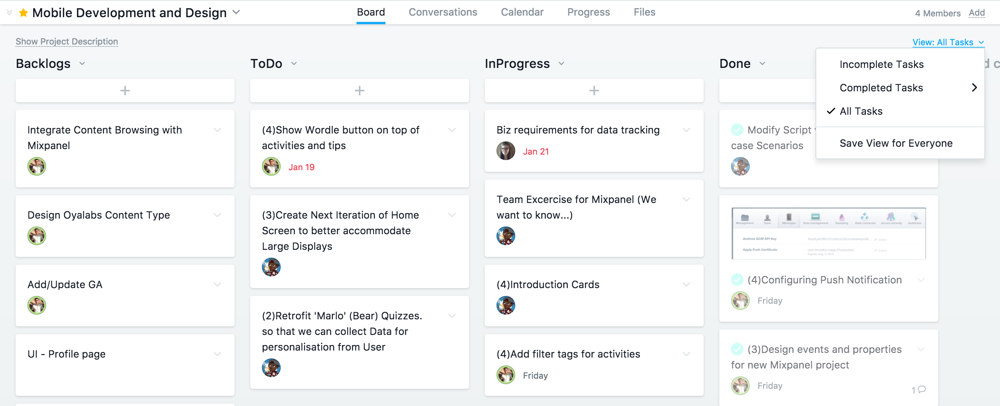
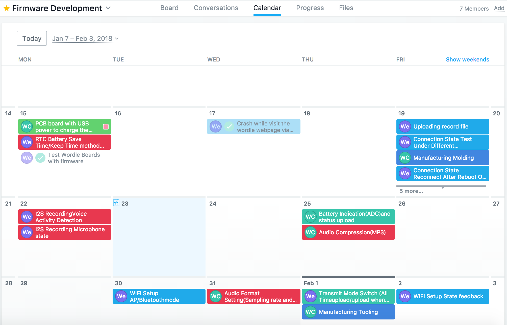
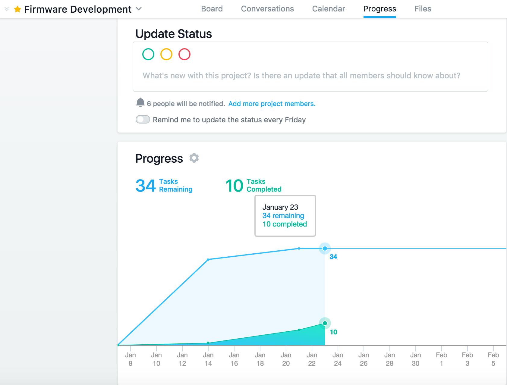
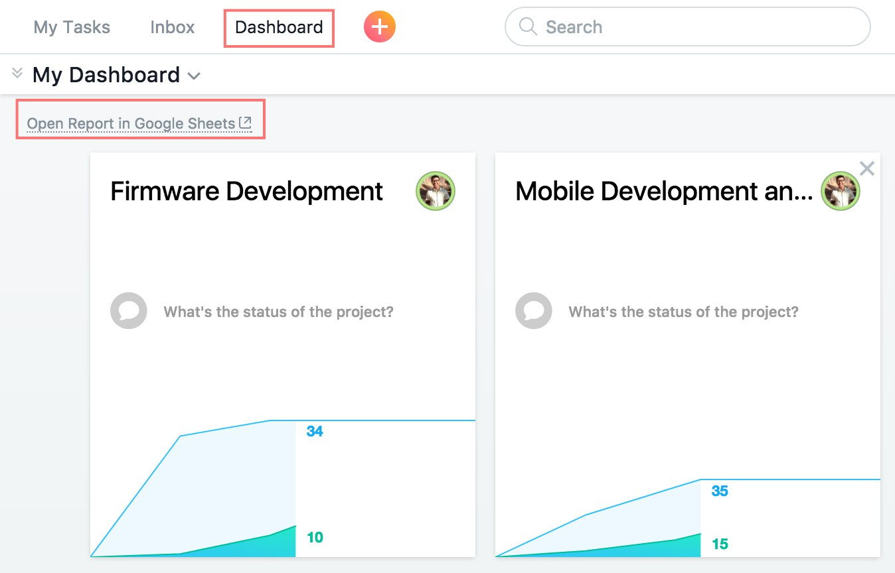

## Asana
* A **simple** project management tool
* **Task-based** - easy to assign and manage
* **Great synchronization** - between devices and users
* **Customizable** - projects, task, subtasks, tags and dashboard
* **Free**... for now

### Objectives

> Onboard new team member to [Asana](https://app.asana.com/) in 5 minutes
> - [ ] Join and track projects
> - [ ] Manage task - individual
> - [ ] Manage task - project
> - [ ] Track progress

### Preparation

> 1. Join [Asana](app.asana.com) workspace
> 2. Download mobile app - [iOS](https://itunes.apple.com/us/app/asana-mobile/id489969512?mt=8)  or [Android](https://play.google.com/store/apps/details?id=com.asana.app&referrer=oyalabs)
> 3. (Optional) Make it become desktop app - [nativefier](https://github.com/jiahaog/nativefier)
> 4. (Optional) Join our [Slack](oyalabs.slack.com) for communication
> 5. (Optional) Know more about [Scrum](https://www.scrum.org/resources/what-is-scrum) - an agile project management framework

#### Join and track projects

[Asana](app.asana.com) actually quite like [Trello](https://trello.com), but more focusing on the personal task management. Like Trello, which have multiple boards, Asana has projects. `Project` is more representative of our goal, which have certain objectives. `Project` goal should be simple, and should have clear expected outcomes, e.g. an app or a device or a marketing campaign. If one single `Task` is too large, should turn into a `Project`. Unlike Trello, Asana is made for tasks, not for record different items, links. Each item should be a `Task` or simple note to describe a task.

> So, choose the projects you tend to join and track, get it started.

1. Find all the projects from side bar
2. Star the project you tend to track
3. Starred projects on top of the side bar after setting up
4. (Optional) Create your own project by press the `+` beside `PROJECTS`

#### Manage task - individual

Cool! You've selected the projects you like, and you can easily access from the top of side bar.   

Now, let's introduce the feature which Trello lack of, the personal tasks - `My Tasks`. You can think of Asana just like a **todo list** app with teamwork function, which meant to let everyone knows what's the tasks need to be done, and when to be done. And not only the **tasks for yourself**, you can also **check others tasks** and ~~even assign new task to them~~ 😜

Inside `My Tasks`

1. You can directly add task, which assign to yourself
2. Using filter to check the incomplete/completed tasks
3. Sort tasks by project or due date
4. Using Calendar to track individual tasks
5. (Optional) You can go to others member's `Tasks` page to do the same thing

> It's especially useful when tracking individual's progress

Inside each `Task`

1. You can edit `title`, `description` for clarify the task
2. You can attach files with task
3. **One `Task` can only assign to one person**
4. Using `Subtask` to assign to multiple members
5. One `Task` can be followed by multiple members, by @ people or manually add follower
6. Set due date for `Task` to enable `Calendar` view

> You can also add task from app easily, like todo list

#### Manage task - project

About project, we're trying to use [Scrum](https://www.scrum.org/resources/what-is-scrum) to manage our projects. for more details about it, please require another tutorial. [link to another tutorial](#)

Within `Project`, it can be created as `List View` or `Board View`, the one below is using board view, which easy to check the progress and manage each [Sprint](https://www.scrum.org/resources/what-is-a-sprint-in-scrum).

But basically, whatever task you can think of, you just add it in the [Backlog](https://www.scrum.org/resources/what-is-a-product-backlog) list, can be just simple description, as long as can identify the task and what need to be done.

And you can easily **drag and drop** the task you want **to move** to another list, just like Trello.

To **show and hide the completed tasks**, can use the filter on the top left on the screen.

#### Track progress

Ah yeah! Final step!
> Now you've the projects you followed and you know how to manage the tasks for yourself and project.
>
> So, how to track it.

- From `Calendar`, you can have a general idea about how things going in terms of time.

- From `Progress`, you can check the completed rate, and also can join the project to `Dashboard`

- Within the `Dashboard`, you can check multiple projects at one glance. Also be able to export to an auto-updated Google Spreadsheet for further customize progress check.

### Conclusion

Asana is a light-weight easy-to-lean project management app, and can be simply set up compare with Trello. Also within free tier, we can add unlimited projects to track, and be able to add/modify task readily.

This tutorial is not comprehensive, but still conclude the features we'll need to use in terms of manage the project and teamwork.

Please feel free to suggest and add content on our [Oyalabs Github](https://github.com/oyalabs/oyalabs.github.io).

Cheers.
